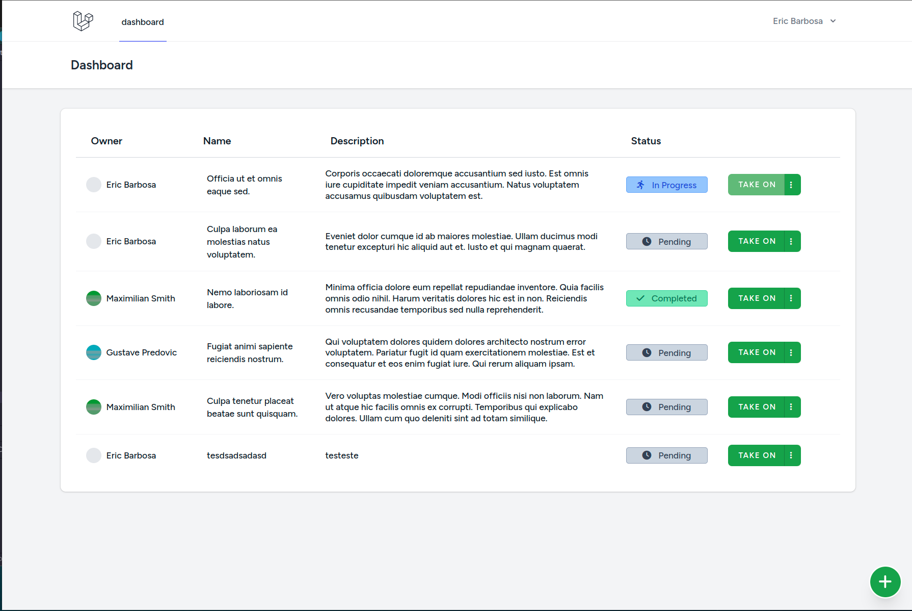
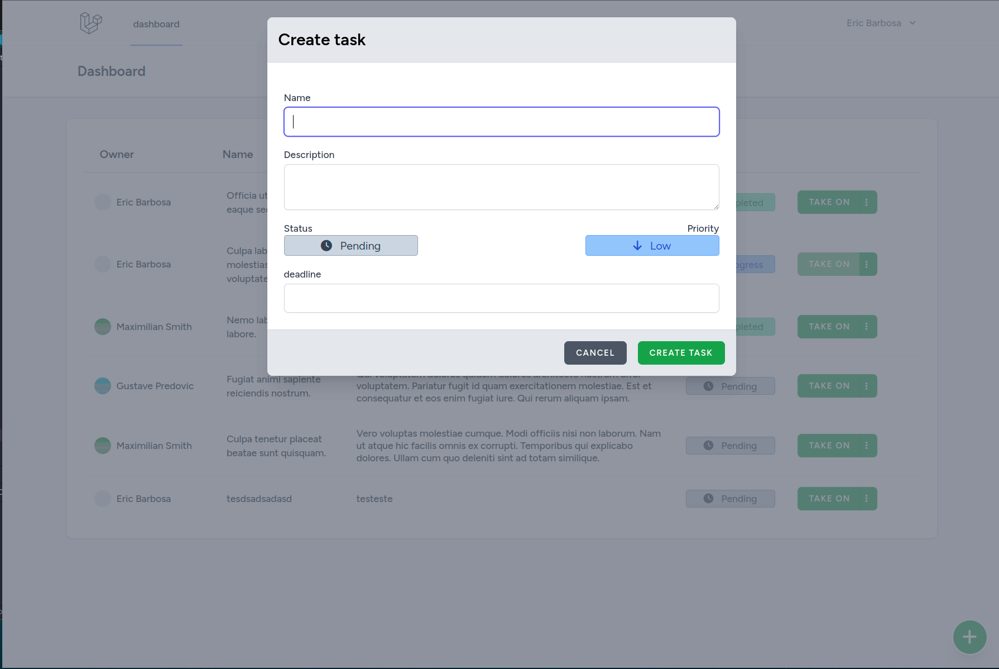
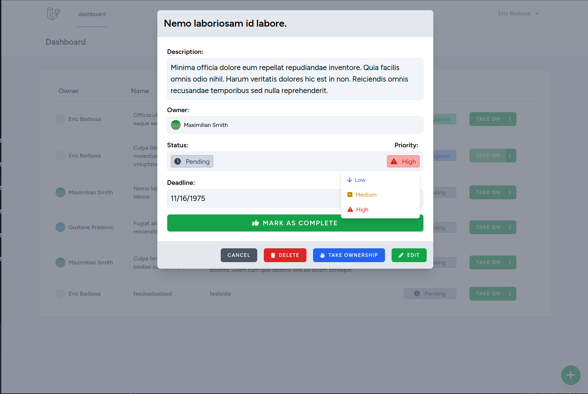
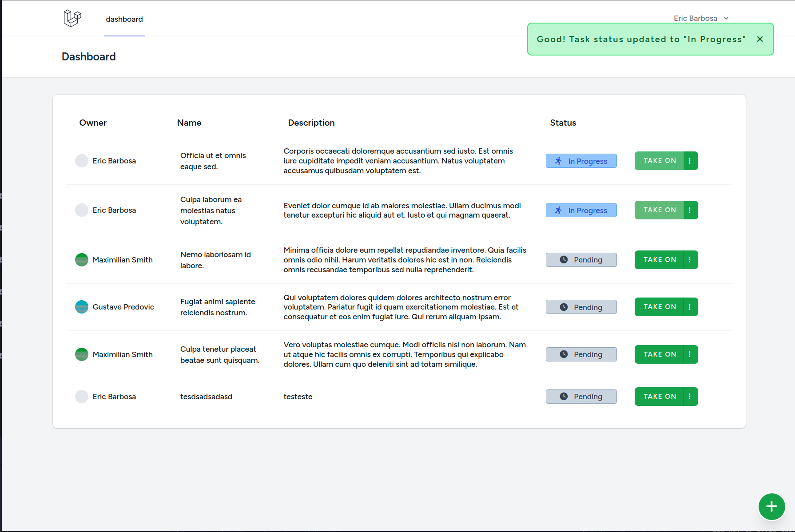
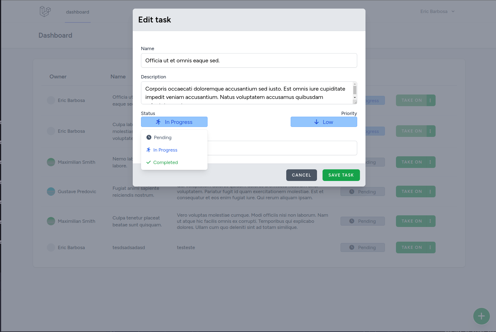

# Task Planner - Laravel + Vue.js

## Features:

1. Tasks listing
2. Task creation
3. Task edition
4. Task visualization
4. Update status in the listing screen
5. Take on task, to set the status to In Progress in the listing screen
6. Go directly to edition, using the "more actions" button
7. Take the ownershio of the task, using the "more actions" button
8. Delete task using the "more actions" button
9. Update the severity on the View modal
10. Update the status on the View modal

## How to run the project:

This project uses the same boilerplate provided by the original test repository, so the instructions are the same:

To use this project you can clone this repo and start the application setup, make sure you have `PHP/composer` and `Docker` installed:
-  Save the file `.env.example` as `.env`
-  Run `composer install` To install dependencies
-  Bring the laravel sail containers up with `./vendor/bin/sail up -d`
-  Run `./vendor/bin/sail npm install` To use the npm from the default docker provided by Laravel Sail
-  Run `./vendor/bin/sail artisan migrate` To initialize the sqlite database (it should create database/database.sqlite file)
-  Run `./vendor/bin/sail artisan db:seed` If you want to start with some data
-  Run `./vendor/bin/sail npm run build` To build and to watch for changes replace `build` with `dev`
-  Go to http://localhost:8080 and register an account, on the dashboard page you can work on the task

## Preview images:

### Listing tasks:

### Task creation:

### Task view:

### Message handling:

### Task edition:
